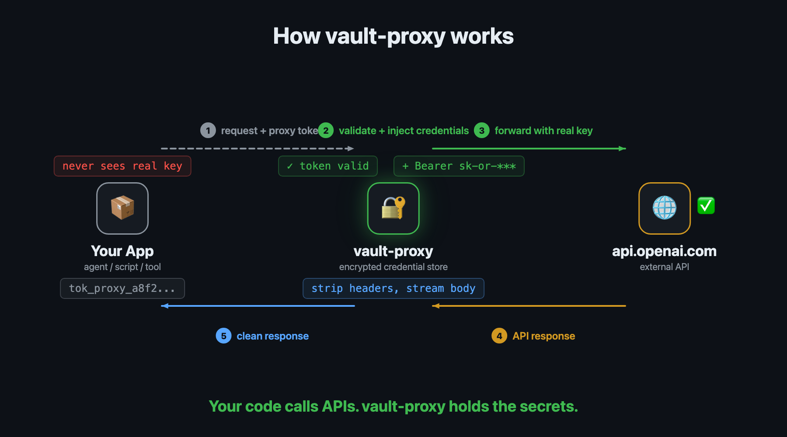

# vault-proxy

Self-hosted secrets vault with HTTP proxy for authenticated API calls. Two binaries, zero runtime dependencies, single encrypted file for storage.

Credentials never leave the vault -- the proxy injects them server-side. AI agents and tools call APIs through the proxy without ever seeing API keys.



## Why vault-proxy?

AI agents need API keys to call external services. Embedding keys in agent code or environment variables is risky -- leaked prompts, log files, or subprocess access can expose them.

vault-proxy sits between your agent and the API. The agent authenticates with a scoped token that can only proxy requests, never read secrets. The vault handles credential injection, OAuth2 token refresh, and service account JWT exchange automatically.

## Features

- **AES-256-GCM encryption** at rest (key derived from master password via Argon2id)
- **HTTP proxy** with automatic credential injection (bearer, header, basic, OAuth2, service account)
- **OAuth2 token refresh** -- lazy refresh at proxy time, tokens persist across restarts
- **Service account JWT exchange** -- Google SA key files stored encrypted, RS256 JWT signed with stdlib
- **Encrypted file storage** -- store credential files (SA JSONs, client secrets) in the vault
- **Scoped tokens** -- `admin` for full CRUD, `proxy` for API calls only (safe to give to AI agents)
- **Zero runtime dependencies** -- single static binary, no database, no external services
- **Go SDK** -- `pkg/client` is importable by any Go project
- **[Python SDK](https://github.com/alamparelli/vault-proxy-python)** -- `pip install vault-proxy`

## Quick Start

### Option A: Docker (recommended)

```bash
docker run -d --name vault \
  -p 8390:8390 \
  -v vault-data:/data \
  ghcr.io/alamparelli/vault-proxy:latest
```

Or with Docker Compose:

```bash
git clone https://github.com/alamparelli/vault-proxy
cd vault-proxy
docker compose up -d
```

### Option B: Build from source

```bash
git clone https://github.com/alamparelli/vault-proxy
cd vault-proxy
go build -o vault-server ./cmd/vault-server
go build -o vault-cli ./cmd/vault-cli
./vault-server --listen 127.0.0.1:8390 --data-dir ~/.vault-proxy
```

Requires Go 1.24+.

### Setup

```bash
# Unlock (creates vault on first use)
./vault-cli unlock
# Enter master password when prompted

# Add a service
./vault-cli service add '{
  "name": "openrouter",
  "base_url": "https://openrouter.ai/api",
  "auth": {"type": "bearer", "token": "sk-or-v1-xxxxx"}
}'

# Create a proxy token for your agent
./vault-cli token create proxy
# Output: tok_abc123... (give this to your agent)

# Proxy a request
./vault-cli proxy openrouter POST /v1/chat/completions \
  '{"model":"anthropic/claude-haiku-4-5","messages":[{"role":"user","content":"hello"}]}'
```

## SDKs

### Go

```go
import "github.com/alamparelli/vault-proxy/pkg/client"

c := client.New() // reads VAULT_ADDR + VAULT_TOKEN from env
resp, err := c.Proxy("openrouter", "POST", "/v1/chat/completions", body)
```

### Python

```bash
pip install vault-proxy
```

```python
from vault_proxy import VaultClient

client = VaultClient()  # reads VAULT_ADDR + VAULT_TOKEN from env
resp = client.proxy("openrouter", "POST", "/v1/chat/completions", json={
    "model": "anthropic/claude-haiku-4-5",
    "messages": [{"role": "user", "content": "hello"}],
})
print(resp.json())
```

### Any language (HTTP)

```bash
curl -X POST http://127.0.0.1:8390/proxy/openrouter/v1/chat/completions \
  -H "Authorization: Bearer $VAULT_TOKEN" \
  -H "Content-Type: application/json" \
  -d '{"model":"...","messages":[...]}'
```

## Auth Types

| Type | Use case | Auto-refresh |
|------|----------|:------------:|
| `bearer` | Static API keys (OpenAI, Anthropic, etc.) | No |
| `header` | Custom header auth (`X-API-Key`, etc.) | No |
| `basic` | Username/password (Jira, Confluence, etc.) | No |
| `url` | Token in URL path (`{token}` placeholder in base_url) | No |
| `oauth2_client` | OAuth2 with refresh token (Google APIs, etc.) | Yes |
| `service_account` | Google service account JWT exchange | Yes |
| `ssh_key` | SSH key authentication (exec, upload, download) | No |

See [docs/AUTH_SETUP.md](docs/AUTH_SETUP.md) for detailed setup instructions for each auth type, including OAuth2 browser flow and file-based setup.

### Examples

```bash
# Bearer token (most APIs)
./vault-cli service add '{
  "name": "openrouter",
  "base_url": "https://openrouter.ai/api",
  "auth": {"type": "bearer", "token": "sk-or-v1-xxxxx"}
}'

# Custom header
./vault-cli service add '{
  "name": "anthropic",
  "base_url": "https://api.anthropic.com",
  "auth": {"type": "header", "header_name": "x-api-key", "header_value": "sk-ant-xxxxx"}
}'

# URL path token (key in URL, e.g. Klipy, Giphy)
./vault-cli service add '{
  "name": "klipy",
  "base_url": "https://api.klipy.com/api/v1/{token}",
  "auth": {"type": "url", "token": "your-api-key"}
}'

# OAuth2 with automatic token refresh
./vault-cli service add '{
  "name": "google-analytics",
  "base_url": "https://analyticsdata.googleapis.com",
  "auth": {
    "type": "oauth2_client",
    "client_id": "1234.apps.googleusercontent.com",
    "client_secret": "GOCSPX-xxx",
    "token_url": "https://oauth2.googleapis.com/token",
    "refresh_token": "1//0xxx",
    "scopes": ["https://www.googleapis.com/auth/analytics.readonly"]
  }
}'

# Google service account
./vault-cli file upload my-sa-key service-account.json
./vault-cli service add '{
  "name": "bigquery",
  "base_url": "https://bigquery.googleapis.com",
  "auth": {
    "type": "service_account",
    "file_ref": "my-sa-key",
    "sa_scopes": ["https://www.googleapis.com/auth/bigquery.readonly"]
  }
}'

# SSH key authentication
./vault-cli file upload my-ssh-key ~/.ssh/id_ed25519
./vault-cli service add '{
  "name": "my-server",
  "auth": {
    "type": "ssh_key",
    "ssh_host": "192.168.1.100",
    "ssh_port": 22,
    "ssh_user": "deploy",
    "ssh_key_file_ref": "my-ssh-key"
  }
}'
# Use: POST /ssh/my-server/exec, /ssh/my-server/upload, /ssh/my-server/download

# SSH with command restrictions (only these commands are allowed)
./vault-cli service add '{
  "name": "prod-server",
  "auth": {
    "type": "ssh_key",
    "ssh_host": "10.0.1.50",
    "ssh_user": "deploy",
    "ssh_key_file_ref": "prod-key",
    "ssh_allowed_commands": ["docker ps", "docker logs", "systemctl status"]
  }
}'
```

### Session Cookies (Sticky Sessions)

Some APIs require cookies to be persisted between calls (load balancer sticky sessions, server-side sessions, CSRF tokens). Enable `session_cookies` to have the proxy automatically capture and re-send cookies:

```bash
./vault-cli service add '{
  "name": "my-api",
  "base_url": "https://api.example.com",
  "auth": {"type": "bearer", "token": "sk-xxx"},
  "session_cookies": true
}'
```

How it works:
- Upstream `Set-Cookie` headers are **captured server-side** (never forwarded to the client)
- Stored cookies are **re-injected** into all subsequent proxy requests to that service
- Cookie jar is **in-memory only** -- cleared on vault lock/restart
- One shared jar per service (all callers share the same session affinity)
- Works with any session mechanism: AWS ALB, JSESSIONID, ASP.NET, PHPSESSID, custom cookies

## Token Scopes

| Scope | Can do | Use case |
|-------|--------|----------|
| `admin` | Everything: CRUD services/files, create tokens, proxy | Human operator, setup |
| `proxy` | Proxy requests, list services (no secrets), health | AI agents, tools |

```bash
./vault-cli token create proxy    # Safe to give to AI agents
./vault-cli token list
./vault-cli token revoke a64f2e...
```

## File Storage

Store credential files (service account JSONs, client secrets) encrypted in the vault.

```bash
./vault-cli file upload google-secret client_secret_1009.json
./vault-cli file list
./vault-cli file download google-secret output.json
./vault-cli file delete google-secret
```

## API Reference

| Method | Path | Auth | Description |
|--------|------|------|-------------|
| `GET` | `/health` | none | `{"status":"locked\|unlocked"}` |
| `POST` | `/auth/unlock` | none | Unlock vault, returns admin token |
| `POST` | `/auth/lock` | session | Lock vault, revoke all tokens |
| `GET` | `/services` | session | List services (no secrets) |
| `GET` | `/services/{name}` | session | Service info (no secrets) |
| `POST` | `/services` | admin | Add/update service |
| `DELETE` | `/services/{name}` | admin | Remove service |
| `ANY` | `/proxy/{service}/{path}` | session | Proxy with auth injection |
| `POST` | `/files` | admin | Upload file (multipart, 5MB max) |
| `GET` | `/files` | admin | List stored files |
| `GET` | `/files/{name}` | admin | Download file |
| `DELETE` | `/files/{name}` | admin | Delete file |
| `POST` | `/tokens` | admin | Create token |
| `GET` | `/tokens` | admin | List tokens |
| `DELETE` | `/tokens/{id}` | admin | Revoke token |
| `POST` | `/auth/oauth2/authorize` | admin | Start OAuth2 browser flow |
| `GET` | `/auth/oauth2/callback` | none | OAuth2 callback (browser redirect) |

## Configuration

### Environment Variables

| Variable | Default | Description |
|----------|---------|-------------|
| `VAULT_ADDR` | `http://127.0.0.1:8390` | Server address |
| `VAULT_TOKEN` | -- | Session token (overrides `~/.vault-proxy/session`) |

### Server Flags

```
--listen    Address to listen on (default: 127.0.0.1:8390)
--data-dir  Directory for vault.enc (default: ~/.vault-proxy)
--token-ttl Token TTL (default: 24h)
```

## Security

- Server binds to `127.0.0.1` only -- never exposed externally
- All credentials encrypted at rest with AES-256-GCM (key from Argon2id)
- Proxy tokens can call APIs but never read or modify secrets
- Caller's `Authorization` header is stripped before forwarding
- SSRF protection: private/loopback/link-local IPs blocked, HTTPS enforced
- Brute-force protection on unlock with exponential backoff
- Every proxy call logged (service, method, path, status, duration -- never credentials)
- URL auth tokens masked in all log output and error messages
- SSH exec supports per-service command allowlists (`ssh_allowed_commands`)
- SFTP upload/download blocks writes to sensitive system directories (`/etc/`, `/root/.ssh/`, etc.)
- Session cookies stored server-side only (never forwarded to clients)
- `vault.enc.bak` backup created on every save
- Master password lost = no recovery

## Project Structure

```
cmd/
  vault-server/    Server binary (HTTP API + proxy)
  vault-cli/       CLI binary (human + AI agent interface)
internal/
  api/             HTTP handlers, auth middleware, proxy
  crypto/          AES-256-GCM encryption, Argon2id KDF
  oauth2/          OAuth2 refresh + service account JWT exchange
  vault/           Encrypted store, types
pkg/
  client/          Go SDK (importable by any Go project)
```

## License

[MIT](LICENSE)
